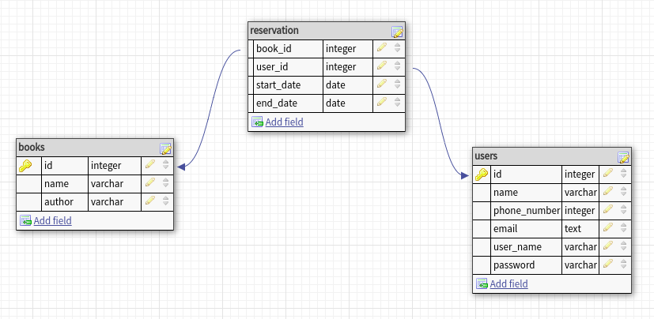

# w6-book-reservation
 made by: Ahmad, Farah, Iman, Israa.

 ### What?!
 a website to reserve books.

 ### How?!
 By using **__postgreSQL__** we made a database
 that contains 3 TABLES:

  * Books TABLE.
  * Users TABLE.
  * reservations TABLE.

### Why?!
To make an automatic reservation library!
